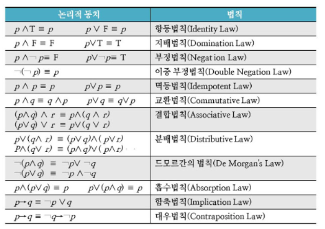

영상: https://www.youtube.com/playlist?list=PLRx0vPvlEmdDgOIBt9MKQl-uMVrxtac4n

### 1강 이산수학 개요
- 불연속적인 숫자를 다루는 수학
- 컴퓨터를 위한 수학, 참과 거짓으로 살펴보는 컴퓨터 수학, 전산, 정보 수학, 1학년이나 처음 컴퓨터를 배우는 입장에서 배우게됨, 자료구조 또는  알고리즘의 베이스, 논리적 사고, 컴퓨팅 사고력 향상

 

### 2강 명제와 연산자

- 명제
  - 참 혹은 거짓으로 진리를 명확하게 구분할 수 있는 문장을 명제라 한다. 

- 연산자

  - Not
  - And(논리합) : 둘다 참일때만 참의 값을 가짐
  - Or(논리곱) : 하나만 참이라면 참의 값을 가짐
  - Exclusive or (배타적 논리합) : 둘중 한개만 참인 경우 참값
  - Implication(조건명제) : ~일때 ~이다

  | p    | q    | p -> q |
  | ---- | ---- | ------ |
  | T    | T    | T      |
  | T    | F    | F      |
  | F    | T    | T      |
  | F    | F    | T      |

  - Biconditional(쌍방 조건명제) : 두 값이 일치할때 참값을 반환

 

### 3강 역, 이, 대우
- | p    | q    | ~p   | ~q   | p -> q | q -> p (역) | q -> p (이) | ~q -> ~p (대우) |
  | ---- | ---- | ---- | ---- | ------ | ----------- | ----------- | --------------- |
  | T    | T    | F    | F    | T      | T           | T           | T               |
  | T    | F    | F    | T    | F      | T           | T           | F               |
  | F    | T    | T    | F    | T      | F           | F           | T               |
  | F    | F    | T    | T    | T      | T           | T           | T               |

 

### 4강 동치 관계

- 논리적으로 일치한다는 의미

- 드모르간의 법칙, 흡수 법칙, 부정 법칙, 함축 법칙 (p -> q ==  ~p V q)

  

