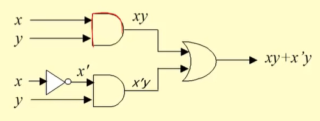
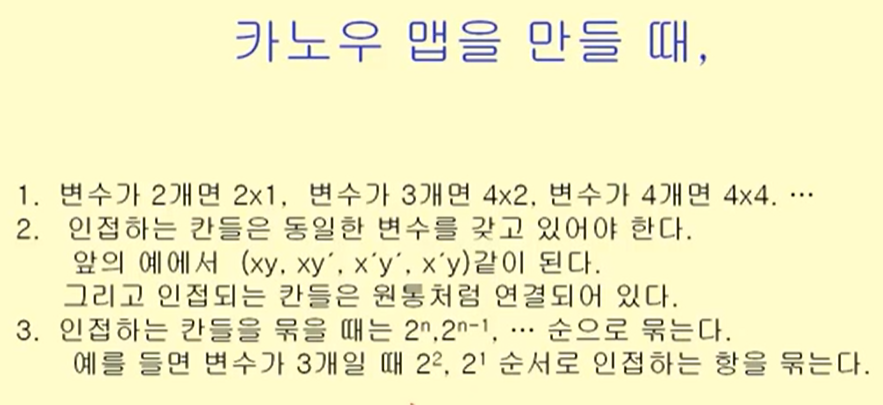
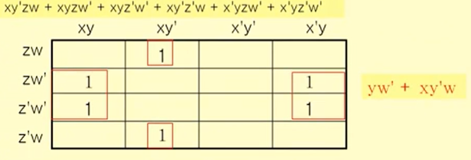

영상: https://www.youtube.com/playlist?list=PLD8rdlfZeJk7ijUM8ckwLLNyDKRD2aQa2

## 명제와 연산자

### 추론,연역법과 귀납법
- 추론 : 이미 참으로 알고 있는 명제들로부터 새로운 참인 명제를 찾아내는 과정
- 연역법 : 형식 논리의 명제의 틀에 기반을 투고 있다. (p는 q이고 p가 참이면, q는 참이다)
- 귀납법 : 개별적인 사실을 말하는 명제들로부터 일반적인 결론을 도출하는 방법 (한계 : 모든 원소에 대해 참인 것을 밝힐 수 없다.)

### 수학적 귀납법
- 1. n = 1일때 참임을 보인다.
  2. n = k일때 참임을 보인다
  3. n = k+1일때 참임을 보인다
  4. 따라서 명제는 모든 원소에 대해 참이다

 

## 부울 대수(Boolean Algebra)

> 부울 대수란? 
>
> 어떤 명제의 참과 거짓을 이진수 1과 0에 대응시켜서 명제와 명제간의 관계를 수학적으로 표현하는 것

### 논리회로 설계
- 논리 회로 설계 문제 - 입출력 정의 - 부울 함수 - 부울식 - 부울식 최소화 - 논리 회로
- 

- 부울식 최소화

  

  

