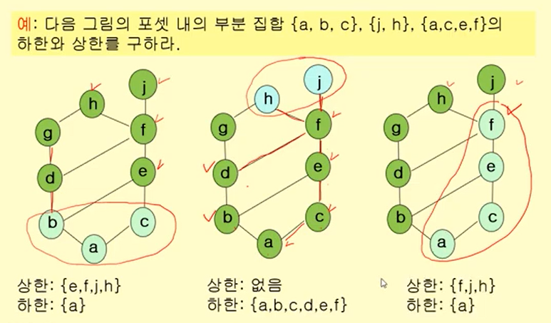
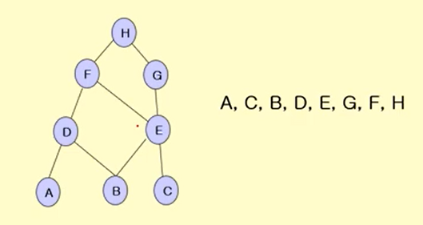

영상: https://www.youtube.com/playlist?list=PLD8rdlfZeJk4n5XQc6bMTZ9eh1C4vGmKQ

### 관계의 정의와 개념
- 관계란 어떤 집합의 원소들을 순서쌍으로 나타낸 것이다. 
- 카티션 곱 : 두개의 임의의 집합 A, B에서 A와 B의 카티션 곱은 모든 순서쌍 (a, b)의 집합이다. 순서는 중요하다. 
- 이진 관계 : A로부터 B로의 이진 관계는 카티션 곱의 부분집합이다. 부분집합에 속한다면 관계가 있다.
- 정의역, 치역

<br>

### 관계의 표현과 합성

**관계의 표현**

- 화살 그림 : 정의역과 치역을 그림으로 나타냄.
- 관계 행렬 : (열) -> (행)을 행렬로 표시하며 관계가 존재한다면 1, 존재하지 않다면 0.
- 방향 그래프 : 관계 R이 유한집합으로부터 자신으로 가는 관계일 때 표현 가능하다.

**관계의 합성**

- A에서 B(R), B 에서 C로 간다(S). 즉 A로부터 C로의 관계(RS)
- 관계 행렬을 통해 합성 관계를 구할 수 있다. 

<br>

### 관계의 유형

**이항관계**


- 집합 내의 원소들간의 존재할 수 있는 관계에 대한 개념
- 이항 관계는 n항 관계에서 n이 2인 특수 경우 - 우리가 흔히 생각하는 "a는 b보다 크다"와 같은 개념도의 관계의 하위 개념
- 관계를 이야기할 때 함수를 빼놓을 수 없는데 함수는 관계의 하위 개념이면서 동시에 프로그래밍의 꽃
- 함수의 정의 - 첫 번째 집합의 임의의 한 원소를 두 번째 집합의 오직 한 원소에 대응시키는 대응 관계" 이기 때문
- 특이한 관계 - 반사, 대칭, 반대칭, 비대칭, 추이 관계
- 추이관계 - 데이터 베이스의 관계를 제 3 정규형으로 만들기 위해 추이적 함수 종속성을 제거 해야 한다, 그래프에서 경로 개념에서 추이적 관계를 생각 가능: 정점 a와 b(aRb), b와 c(bRc)가 연결되어 있으면 a에서 c로 가는 경로가 존재한다(aRc)는 식으로 생각할 수 있다.

<br>

### 관계의 닫힘
- R* 가 관계 R을 포함하면서 원하는 특성 P가 만족되는 가장 작은 집합이라면 R*는 그 특성 P에 대해 R의 닫힘이라고 한다. 
- 반사적 닫힘 : (a, a)를 추가한 것
- 대칭적 닫힘 : 역관계를 추가한 것
- 추이적 관계 : R의 연결적 관계

<br>

### [동치 관계](1.이산수학/1.이산수학기초.md)

(1. 이산수학기초.md 참고) 생략

<br>

### 부분 순서 관계
- 집합 A위에서 관계 R이 반사적이고 반대칭적이고 추이적이라면 R은 부분적 순서 관계
- 부분 순서 관계에 있을때 두 원소를 비교할 수 있다. 반사적, 반대칭적, 추이적 관계를 만족한다. 
- 포셋 : 부분적 순서가 정의되는 원소들의 집합
- 선행요소, 후행요소, 직전 선행 요소(x, y, z)
- 하세 도표 : 직전 선행 요소와 직전 후행 요소를 연결한 것
- 전체 순서 : 오름차순, 내림차순, 사전적 순서로 정렬을 할 때 사용
- 극대 원소, 극소 원소 : 선행 원소나 후행 원소가 더 이상 존재하지 않을 때 해당하는 원소
- 상한, 하한, 최소 상한, 최대 하한 : 포셋 내의 부분집합 요소들과 모두 연결되어 있는 상태에서 큰 값인지 작은 값인지 구분해야 한다. 



- 최대, 최소

- 격자 : 최소 상한과 최대 하한이 한 개씩만 존재하는 것

- 위상 정렬 : 집합을 정렬할 때 부분 순서 관계를 만족하면서 전체 정렬을 할 수 있어야 한다. 

  ```
  # 위상 정렬 알고리즘
  
  Procedure Topological Sort (S:부분 순서 집합)
  {
  	k = 1
  	while (S!=0)
  	{
  		ak = S내 극소 원소
  		S = S - {ak}
  		k = k + 1
  	}
  } // {a1, a2, ..., an} 정렬 결과
  ```

  


