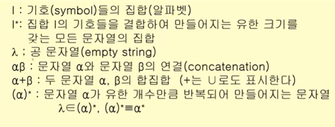
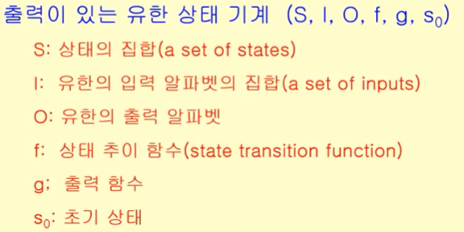
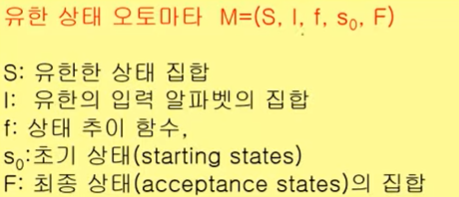
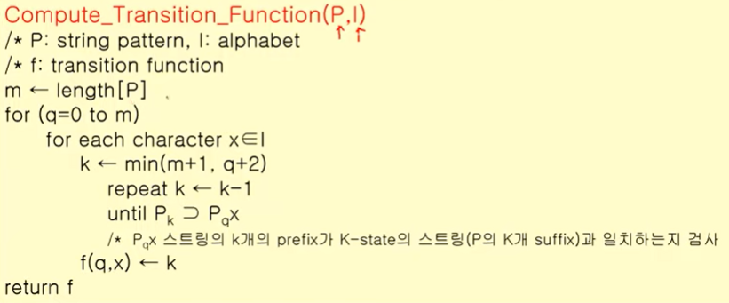
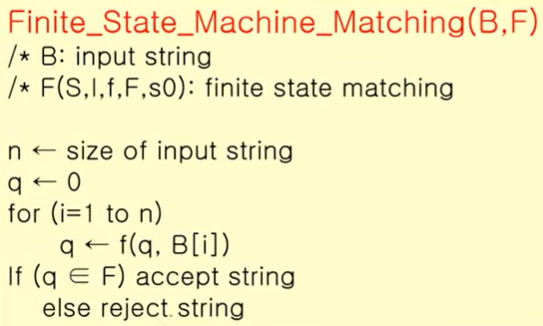

영상: https://www.youtube.com/playlist?list=PLD8rdlfZeJk7aDHa1VxqnX5TyQ4FmgavH

### 형식언어와 문법
- 언어는 기호들의 집합으로부터 만들어지는 문자열(또는 수식)
- 언어 기호들, 문자열을 형성하는 규칙(syntax), 어떤 의미를 갖는(semantics) 조건이 필요하다. 
- 형식언어 : 심벌(기호), 알파벳(기호들의 집합), 문자열(기호들의 나열), 공 문자열(길이가 0인 문자열). 문자열의 나열을 위해 (기호의 집합V, 단말 기호T, 시작 기호S, 생성 규칙P)이 필요하다.
- 문법의 종류 : 비제한 문법 > 문맥 의존 문법 > 문맥 자유 문법 > 정규 문법
- 문법의 표현 : BNF, 문법 다이어그램, 유도 트리

 

### 정규식과 정규문법
- 
- 정규식은 위 순서대로 재귀적으로 정의된다. 

 

### 유한상태기계
- 0과 1로 주어진 flip-flop과 같은 시스템

- 상태의 집합(S), 입력값의 집합(I), 상태 추이 함수(f)

- 유형 : 출력이 있는 유한 상태 기계(추이함수나 상태로 결정), **출력이 없는 유한 상태 기계(유한 상태 오토마타)**

- 출력이 있는 유한 상태 기계

  

- 출력이 없는 유한 상태 기계 : 출력은 없고 최종 산태 집합이 존재하며 주로 언어 인식 기계에 사용됨

  

 

### 오토마타와 언어

- 계산 능력이 있는 추상 기계와 그 기계를 이용해서 풀 수 있는 문제들을 연구하는 분야  
- 형식 언어를 정의하는 관점에서 컴파일러에서 구분 분석을 하면서 추상 구문 트리를 생성할 때  
- 계산 능력을 가진 추상 기계를 논하는 관점에서 계산 이론적으로 P-NP문제와도 연관성 있음

 

### 스트링 매칭 알고리즘
- 입력된 스트링에서 정해진 패턴을 찾는 문제, 검색 or 파싱에서 많이 사용됨

- 오토마타 생성 알고리즘

  

- 스트링 매칭 알고리즘

  

- O(m^2 * l + n) = O(m^2 + n)

 

### 셈(순열과 조합) - 곱의 법칙과 합의 법칙
- 어떤 두 사건이 발생할 때 동시(연결되어)에 발생한다면 곱의 법칙, 두 사건이 상관 없이 발생한다면 합의 법칙을 따른다. 
- 포함-배제 원리 : 합의 법칙을 적용할 때 중복되어 계산된 경우의 수를 제거해준다. 

