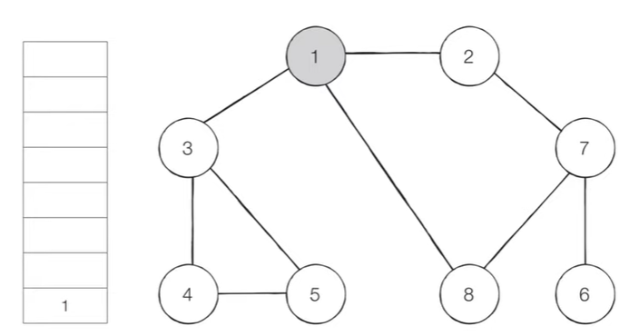
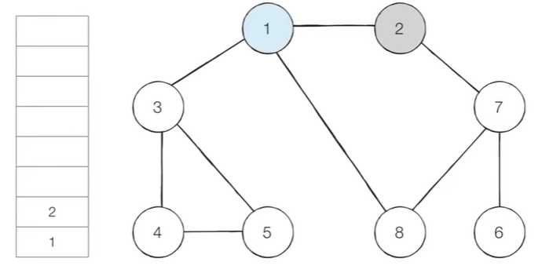
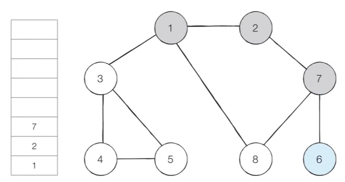
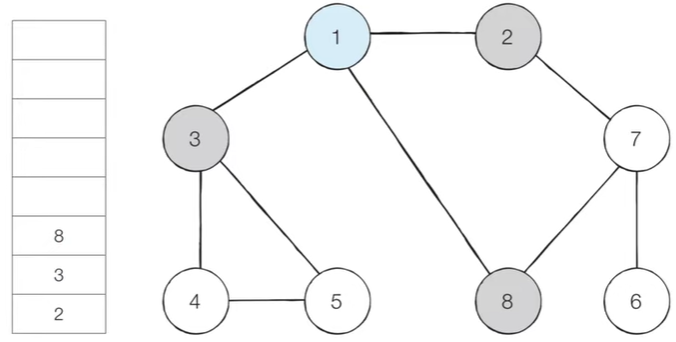
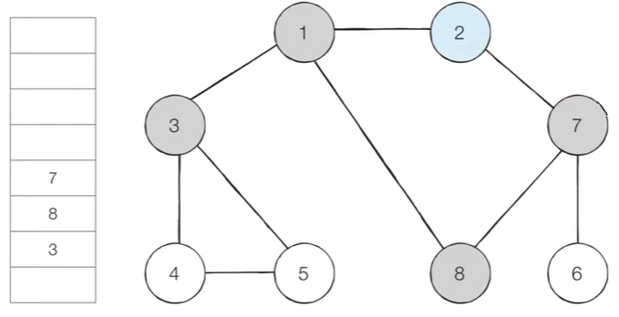
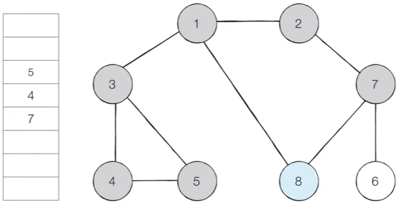

# DFS & BFS

> 그래프 탐색 알고리즘


**스택** : 먼저 들어온 데이터가 나중에 나가는 선입후츨 자료구조(입출구가 동일한 형태)

```python
stack = []

stack.append()  # 원소 넣기
stack.pop()  # 제일 마지막 원소 빼기
```


**큐** : 먼저 들어온 데이터가 먼저 나가는 선입선출 자료구조(입구로 들어와 출구로 순서대로 나가는 형태)

```python
import deque

queue = deque()
queue.append()
queue.popleft()
```


**유클리드 호제법(최대공약수)**

```python
# a b의 최대공약수는 a를 b로 나눈 나머지 r과 b의 최대공약수와 같다.

def gcd(a, b):
    if a % b == 0:
        return b
    else:
        return gcd(b, a % b)
```


<br>

## DFS

> 깊이 우선 탐색(그래프에서 깊은 부분을 우선적으로 탐색하는 알고리즘)


- DFS는 스택(or 재귀 함수)를 이용한다.
  - 탐색 시작 노드를 스택에 삽입하고 방문 처리를 한다.
  - 스택의 최상단 노드에 방문하지 않은 인접한 노드가 하나라도 있으면 그 노드를 스택에 넣고 방문 처리한다. 방문하지 않은 인접 노드가 없으면 스택에서 최상단 노드를 꺼낸다.
  - 더 이상 수행할 수 없을 때까지 반복한다.

 

- 시작 노드를 스택에 넣고 방문 처리한다.




- 1과 연결된 노드 중 방문하지 않은 인접 노드를 하나 정해 스택에 넣고 방문 처리한다. 




- 과정을 반복하다 더 이상 갈 곳이 없다면 스택에서 값을 꺼낸다.




- 스택에 값이 없을 때까지 이 과정을 반복하면 탐색 순서(= 스택에 들어간 순서)는 1 2 7 6 8 3 4 5가 된다.


```python
# DFS 함수
def dfs(graph, v, visited):
    visited[v] = True
    print(v, end='')
    # 현재 노드와 연결된 노드를 재귀로 찾기
    for i in graph[v]:
        if not visited[i]:
            dfs(graph, i, visited)

# 각 노드가 연결된 그래프
graph = [
    [],
    [2, 3, 8],
    [1, 7],
    [1, 4, 5],
    [3, 5],
    [3, 4],
    [7],
    [2, 6, 8],
    [1, 7]
]

# 노드의 방문 정보 표현
visited = [False] * 9  

# DFS 함수 호출
dfs(graph, 1, visited)
```


<br>

## BFS

> 너비 우선 탐색(가까운 노드부터 우선적으로 탐색하는 알고리즘)


- BFS는 큐 자료구조를 이용한다.
  - 탐색 시작 노드를 큐에 삽입하고 방문 처리를 한다
  - 큐에서 노드를 꺼낸 뒤 해당 노드의 인접 노드 중에서 방문하지 않은 노드를 모두 큐에 삽입하고 방문 처리한다.
  - 더 이상 수행할 수 없을 때까지 반복한다.


- 시작 노드를 큐에 넣고 방문 처리한다.


- 큐에서 시작 노드를 꺼내고 방문하지 않은 인접 노드를 큐에 전부 넣어준다.




- 큐에서 제일 아래 값을 꺼내 방문하지 않은 인접 노드를 큐에 삽입하고 방문 처리한다. 




- 큐에서 순서대로 꺼내며 방문하지 않은 인접 노드가 없다면 꺼내기만 하고 큐의 다음 노드로 넘어간다. 

\


- 이 과정을 반복하며 큐의 모든 노드를 탐색하면 전체 노드 탐색 순서(= 큐에 들어간 순서)는 1 2 3 8 7 4 5 6이 된다.


```python
from collections import deque

def bfs(graph, start, visited):
    queue = deque([start])
    visited[start] = True
    
    while queue:
        v = queue.popleft()
        print(v, end='')
        for i in graph[v]:
            if not visited[i]:
                queue.append(i)
                visited[i] = True
                

# 각 노드가 연결된 그래프
graph = [
    [],
    [2, 3, 8],
    [1, 7],
    [1, 4, 5],
    [3, 5],
    [3, 4],
    [7],
    [2, 6, 8],
    [1, 7]
]

# 노드의 방문 정보 표현
visited = [False] * 9  

# DFS 함수 호출
bfs(graph, 1, visited)
```

<br>

<br>

**음료수 얼려 먹기(dfs)**

- 칸막이는 1 구멍은 0일 때 N*M 얼음 틀 모양에서 만들 수 있는 총 아이스크림의 개수를 구하는 프로그램(구멍이 붙어있는 경우 연결되어 있는 것임)

```python
"""
4 5
00110
00011
11111
00000

아이스크림 3개
"""

def dfs(x, y):
    # 범위 벗어나면 종료
    if x <= -1 or x >= N or y <= -1 or y >= M:
        return False
    # 방문하지 않았다면, 즉 구멍칸 0이라면
    if graph[x][y] == 0:
        # 방문처리
        graph[x][y] = 1
        # 상하좌우 위치를 재귀 호출
        dfs(x-1, y)
        dfs(x, y-1)
        dfs(x+1, y)
        dfs(x, y+1)
        return True
    # 구멍칸 외에는 false
    return False


N, M = map(int, input().split())
graph = []
for i in range(N):
    graph.append(list(map(int, input())))

result = 0
for i in range(N):
    for j in range(M):
        # dfs 탐색을 하며 한 구역의 구멍칸을 다 돌았다면 True
        if dfs(i, j) == True:
            # True의 갯수 구하기
            result += 1

print(result)
```

<br>

**미로 탈출(bfs)**

- N*M 크기의 직사각형 미로에서 (1,1)이 현재 위치, 출구는 (N, M)에 위치하며  한 칸씩 이동할 수 있다. 괴물이 있는 부분은 0, 없는 부분은 1일때 탈출하기 위한 최소한의 칸을 구하는 프로그램(시작 칸과 마지막 칸도 계산에 포함한다.)

```python
"""
5 6
101010
111111
000001
111111
111111
"""
from collections import deque

def bfs(x, y):
    queue = deque()
    # 초기 값을 큐에 넣기
    queue.append((x, y))
    # 큐가 빌 때까지 반복
    while queue:
        x, y = queue.popleft()
        # 갈 수 있는 4가지 방향 탐색
        for i in range(4):
            nx = x + dx[i]
            ny = y + dy[i]
            # miro를 벗어난다면 패스
            if nx < 0 or nx >= N or ny < 0 or ny >= M:
                continue
            # 벽이어도 패스
            if miro[nx][ny] == 0:
                continue
            # 해당 노드를 처음 방문하는 경우에 
            if miro[nx][ny] == 1:
                # 거리를 1칸 이동시킨 값을 넣어 갱신하고
                miro[nx][ny] = miro[x][y] + 1
                # 현재 위치를 이동
                queue.append((nx, ny))
    # 도착한 위치의 값이 거리값
    return miro[N-1][M-1]

N, M = map(int, input().split())
miro = [list(map(int, input())) for _ in range(N)]

# 이동할 수 있는 4가지 방향
dx = [-1, 1, 0, 0]
dy = [0, 0, -1, 1]

print(bfs(0, 0))
```


문제 참고 : https://www.youtube.com/watch?v=7C9RgOcvkvo
