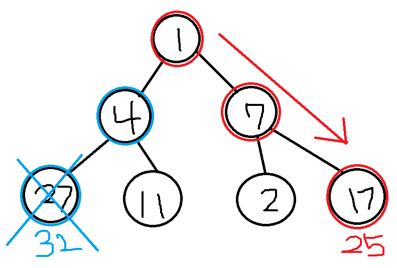

# 그리디 알고리즘(탐욕 알고리즘) & 완전 탐색(브루트 포스)

## 그리디 알고리즘(탐욕 알고리즘)

> 그리디 알고리즘(탐욕 알고리즘)은 현재 상황에서 지금 당장 좋은 것만 고르는 방법. 그리디 알고리즘은 최적의 해를 보장할 수 없지만 최적해를 빠르게 구할 수 있다.

<br>



- 다음 그림에서 그리디 알고리즘은 매 순간마다 큰 값을 선택해 1 > 7 > 17을 선택하게 된다. 하지만 실제로 큰 값이 되기 위해서는 1 > 4 > 27이 선택되어야 했다. 

<br>

**거스름돈 문제**

- [500, 500, 100, 100, 50, 10]원이 있을때 거스름돈 1260원을 거슬러주기 위한 동전의 개수
- 500, 500, 100, 100, 50, 10원 순서로 거스름돈을 준다.

```python
n = 1260
cnt = 0

arr = [500, 500, 100, 100, 50, 10]

for coin in arr:
    cnt += n //coin
    n %= coin
   
print(cnt)
```

- 화폐의 종류가 K일때 시간 복잡도는 O(K)

<br>

**1이 될 때까지**

- N이 주어지고 1을 빼거나 주어진 K로 나눠 N이 1이 될때까지 연산의 횟수를 구한다. 

- N에 대해 최대한 많은 나누기를 수행한다. 1을 빼는 것보다 수를 빨리 줄일 수 있기 때문이다. 

```python
n, k = map(int, input().split())  # 25 3

cnt = 0

while True:
    target = (n // k) * k  # n에 근사값을 구한다
    cnt += (n - target)  # 근사값을 제외한 나머지 수들은 1을 빼기 위한 연산으로 한번에 cnt에 저장한다
    n = target  # 1을 빼고 나눌 수 있는 수들만 남긴다
    
    if n < k:
        break  
    cnt += 1
    n //= k
    
cnt += (n - 1)  # 남은 수에 1씩 빼기
print(cnt) 
```

<br>

 **곱하기 혹은 더하기**

- 각 자리 숫자를 확인하여 곱하기 혹은 더하기만을 사용해 만들 수 있는 가장 큰 수를 구하는 프로그램

```python
nums = input()  # 02984

result = int(nums[0]) 
for i in range(1, len(nums)):
    num = nums[i]
    if num <= 1 or result <= 1:  # 0과 1일때는 더해준다
        result += num
    else:
    	result *= num  # 나머지 수들은 곱해준다

print(result)  # 576
```

<br>

**모험가 길드**

- N명의 모험가는 공포도를 측정하는데 공포도가 X인 모험가는 X명 이상으로 구성한 그룹에 있어야 여행을 떠날 수 있다. 여행을 떠날 수 있는 그룹 수의 최댓값

```python
n = int(input())
data = list(map(int, input().split()))  
data.sort()  # 1 2 2 2 3

result = 0  # 총 그룹의 수
cnt = 0  # 현재 그룹에 포함된 모험가의 수
for i in data:
    cnt += 1  # 현재 그룹에 해당 모험가 포함시키기
    if cnt >= i:  # 모험가 수가 현재 공포도 이상이라면 그룹 결성
        result += 1  # 총 그룹의 수 증가
        cnt = 0  # 모험가의 수 초기화
        
print(result)
```

<br>

<hr>

## [완전 탐색(브루트 포스)](https://github.com/dayeonyang0324/TIL/tree/master/4.Algorithm/Baekjoon/11.%20%EB%B8%8C%EB%A3%A8%ED%8A%B8_%ED%8F%AC%EC%8A%A4)

> 가능한 모든 경우의 수를 일일이 나열하면서 답을 찾는 알고리즘
>
> 완전 탐색 방법으로 for/if문 사용, 비트마스크, 순열, 백트래킹, DFS/BFS가 있다.

- DFS/BFS + 완전 탐색 문제로 길찾기 문제가 있다. 

**상하좌우**

- N * N 크기 공간에서 (1, 1) ~ (N, N)에서 움직인다. 주어진 R, L, U, D로 이동하여 도착하는 좌표를 나타내는 문제

```python
n = int(input())  # 5 
x, y = 1, 1
plans = input().split()  # R R R U D D

dx = [0, 0, -1, -1]
dy = [-1, 1, 0, 0]
move_types = ['L', 'R', 'U', 'D']

for plan in plans:
    for i in range(len(move_types)):
        if plan == move_types[i]:  # 해당하는 타입이 만족하면
            nx = x + dx[i]  # 새로 이동할 좌표를 지정한다
            ny = y + dy[i]
    if nx < 1 or ny < 1 or nx > n or ny > n:  # 공간을 벗어나는 경우는 무시
        continue
    x, y = nx, ny  # 이동한다
    
print(x, y)
```

<br>

**시각**

- 정수 N이 입력하면 00시 00분 00초부터 N시 59분 59초까지의 모든 시각에서 3이 포함된 모든 경우의 수(00시 00분 03초, 00시 13분 00초)

```python
n = int(input())  # 5

cnt = 0
for i in range(n+1):
    for j in range(60):
        for k in range(60):
            # 시, 분, 초 문자열에서 3이 포함되어있는지 확인
            if '3' in str(i) + str(j) + str(k):
                cnt += 1
                
print(cnt)  # 11475
```

<br>

**왕실의 나이트**

- 8 * 8 좌표 평면에서 나이트는 L자 형태(수평 두칸 수직 한칸, 수직 두칸 수평 한칸)로만 이동할 수 있다. 나이트 위치가 주어졌을 때 나이트가 이동할 수 있는 경우의 수(행 1~8, 열 a~h)

```python
now = input()  # a1
row = int(now[1])  # 1
col = int(ord(now[0])) - int(ord('a')) + 1  # a를 숫자로 변환

# 이동할 수 있는 모든 방향 8가지
dircts = [(-2, -1), (-1, -2), (1, -2), (2, -1), (2, 1), (1, 2), (-1, 2), (-2, 1)]

cnt = 0
for dirct in dircts:
    # 갈 수 있는 위치 확인
    next_row = row + dirct[0]
    next_col = col + dirct[1]
    # 범위 안에 들어있다면 cnt 증가
    if next_row >= 1 and next_row <= 8 and next_col >= 1 and next_col <= 8:
        cnt += 1
        
print(cnt)  # 2
```

<br>

**문자열 재정렬**

- 알파벳 대문자로 구성된 문자열이 주어질 때, 모든 알파벳을 오름차순으로 정렬하고 모든 숫자를 더한 값을 이어서 출력한다.

```python
words = input()  # K1KA5CB7
result = []
value = 0

for word in words:
    if word.isalpha():  # 알파벳이라면 리스트에 추가
        result.append(word)
    else:  # 숫자라면 더하기
        value += int(word)
        
result.sort()  # 알파벳을 순서대로 정렬

if value != 0:  
    result.append(str(value))  # 합한 숫자들을 리스트 마지막에 넣기
      
print(''.join(result)  # ABCKK13
```

<br>


문제 참고 : https://www.youtube.com/watch?v=2zjoKjt97vQ
