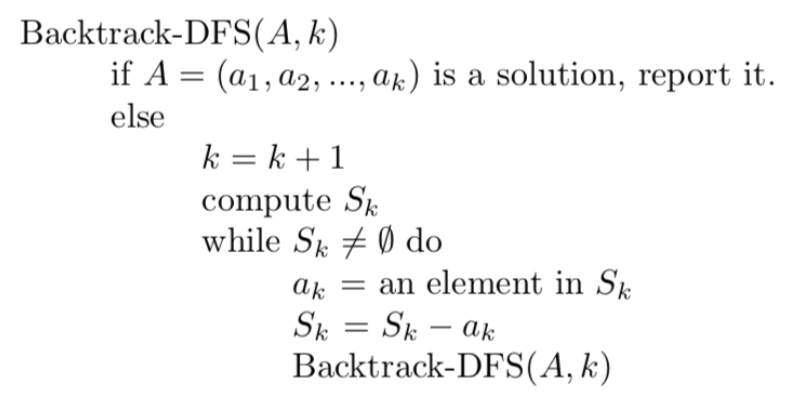
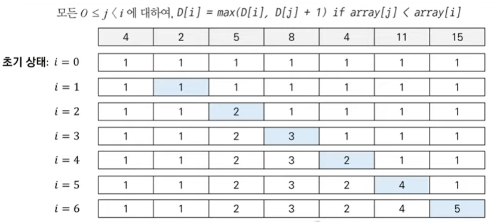

# 백트래킹 & DP(다이나믹 프로그래밍)

## 백트래킹

> '조합' 알고리즘 문제에서 조건이 만족할 때 가능한 모든 조합의 수를 구하는 것. 
>
> 트리를 검사하기 위해 DFS 방식을 사용하며 재귀로 구현한다. 

<br>


#### N-Queen

> 백트래킹의 대표적인 문제로 N-Queen문제가 있다.

- N * N 체스판에 N개의 Queen을 올려놓는 경우의 수를 계산하는 방식
  - 한 칼럼에 Queen을 두고 다음 가능한 자리에 Queen을 두는 과정을 반복한다. N개의 Queen을 두었으면 카운트를 증가하고 성공하기 직전의 상태로 되돌린다. 만약에 없다면 N-1번째 칼럼에 있는 Queen을 다음에 가능한 칸으로 옮긴다. 이 과정을 반복한다. 
- 모든 경우의 수 = 칼럼의 수 ^ 한 칼럼에 퀸을 놓는 경우의 수 = N ^ N
- 시간복잡도 O(N^N)

<br>

**슈도코드**



<br>

**[N-Queen Backtrack-DFS 로 구현하기]()**

```python
N = int(input())
# 방문 리스트를 행, 대각선, 대각선 각각 만들어줌
row, diag1, diag2 = [0] * N, [0] * (2 * N - 1), [0] * (2 * N - 1)


def backtrack(i):
    global cnt

    # 모든 탐색에 성공했다면 카운트하기
    if i == N:
        cnt += 1
        return

    for j in range(N):
        # 값 있는지 확인 하나라도 있으면 안됨
        if row[j] or diag1[i + j] or diag2[j - i]:
            continue

        row[j] = diag1[i + j] = diag2[j - i] = 1  # 방문체크
        backtrack(i + 1)  # 재귀
        row[j] = diag1[i + j] = diag2[j - i] = 0  # 방문취소

cnt = 0
backtrack(0)
print(cnt)

```

<br>

<br>

## 동적 계획법(DP:다이나믹 프로그래밍)

> 메모리를 적절하게 사용하여 수행 시간 효율성을 비약적으로 향상시키는 방법이다. **이미 계산된 결과가 별도의 메모리에 저장**되어 다시 계산하지 않도록 모든 방법을 검토하고 가장 효율적인 결과를 내므로 그리디 알고리즘에 비해 시간이 오래 걸리지만 항상 최적의 해를 구할 수 있다.  시간복잡도를 줄일 수 있다.  (탑다운, 보텀업)

<br>

**피보나치 수열 O(2^N)** 

```python
def fibo(x):
    if x == 1 or x == 2:
        return 1
    return fibo(x - 1) + fibo(x - 2)

print(fibo(3))  # 3
```

<br>

**DP 사용해 피보나치의 중복되는 문제 해결 : O(N)**

```python
# 탑다운(메모이제이션) 방식에서는 재귀 사용
d = [0] * 100  # 데이터를 저장하기 위한 리스트

def fibo(x):
    if x == 1 or x == 2:
        return 1
    if d[x] != 0:
        return d[x]
    d[x] = fibo(x - 1) + fibo(x - 2)
    return d[x]

print(fibo(99))
```

```python
# 보텀업 방식에서는 재귀가 아닌 반복문 사용
d = [0] * 100

d[1] = 1
d[2] = 1
n = 99

for i in range(3, n+1):
    d[i] = d[i - 1] + d[i - 2]
    
print(d[n])
```

<br>

### TIP!

- 문제가 주어졌을때 그리디, 구현, 완전탐색으로 풀이 방법이 생각나지 않으면 다이나믹 프로그래밍을 고려한다. 
- 재귀 함수로 비효율적인 완전 탐색 프로그램을 작성한 후에 중복 문제를 제거할 수 있다면 코드를 개선한다. 

<br>

**개미 전사**

- 주어진 식량 창고에는 정해진 수의 식량을 저장하고 있으며 식량 창고에서 식량을 몰래 훔치기 위해서는 최소 한 칸 이상 떨어진 식량창고를 약탈해야 한다. 얻을 수 있는 식량의 최댓값을 구하는 프로그램
- 특정한 i번째 식량 창고에 대해 i-1번째까지의 경우와 (i-2번째 + i번째) 식량의 양을 비교하여 더 많은 양을 선택하면 된다. 

```python
# 4 
# 1 3 1 5

n = int(input())
arr = list(map(int, input().split()))

d = [0] * 100
d[0] = arr[0]
d[1] = max(arr[0], arr[1])

for i in range(2, n):
    d[i] = max(d[i - 1], d[i - 2] + arr[i])
    
print(d[n - 1])
```

<br>

**1로 만들기**

- 5로 나누기, 3으로 나누기, 2로 나누기, 1 빼기와 같은 4가지 방법을 사용해 주어진 숫자를 1로 만드는데 최소한의 횟수 구하기.

```python
x = int(input())

d = [0] * 100
for i in range(2, x + 1):
    d[i] = d[i - 1] + 1
    if i % 2 == 0:
        d[i] = min(d[i], d[i // 2] + 1)
    if i % 3 == 0:
        d[i] = min(d[i], d[i // 3] + 1)
    if i % 5 == 0:
        d[i] = min(d[i], d[i // 5] + 1)
    
print(d[x])
```

<br>

**효율적인 화폐 구성**

- N가지 종류의 화폐를 최소한으로 사용해서 가치의 합이 M원이 될 때, 최소한의 화폐 개수를 출력하는 프로그램
- 화폐 종류를 1개씩 선정하여 모든 값에 가능한지 여부를 확인한다. 더 작은 개수가 가능하면 갱신한다. 

```python
# 2 15
# 2
# 3

n, m = int(input())
arr = []
for i in range(n):
    arr.append(int(input()))
    
d = [10001] * (m + 1)  # 문제에서 요구한 최댓값 + 1로 리스트 생성
d[0] = 0
for i in range(n):  # 가능한 화폐 종류
    for j in range(arr[i], m + 1):  # 가능한 값들을 돌면서
        if d[j - arr[i]] != 10001:  
            # 화폐 단위만큼 작은 수에 이미 값이 존재한다면 갯수 +1 할 수 있음
           #화폐 단위가 2일떄 2원의 값이 있다면 2원을 만들 수 있는 갯수는 +1
            d[j] = min(d[j], d[j - arr[i]] + 1)
            
if d[m] == 10001:
    print(-1)
else:
    print(d[m])
```

<br>

**금광 문제**

- n * m 의 크기의 금광에 특정한 양의 금이 들어있다. 첫 번쨰 열의 어느 행이든 상관없이 출발하여  m-1번 동안오른쪽 위, 오른쪽, 오른쪽 아래로 이동할 수 있다. 이동하여 최대한 얻을 수 있는 금의 양을 구하는 프로그램
- 왼쪽위, 왼쪽, 왼쪽 아래 중 최대값을 구하여 현재 위치의 금의 양과 더해준다.

```python
# 3 4
# 1 3 3 2 2 1 4 1 0 6 4 7

n, m = map(int, input().split())
arr = list(map(int, input().split()))

table = []  # 금 테이블 생성
index = 0
for i in range(n):
    table.append(arr[index:index + m])
    
for j in range(1, m):  # 인덱스 1번째 열부터 순회
    for i in range(n):
        if i == 0:  # 첫번째 열은 위가 없으므로 왼쪽 위는 0
            left_up = 0
        else:  # 현재의 왼쪽 위 위치의 값
            left_up = table[i - 1][j - 1]
            
        if i == n - 1:  # 마지막 열은 아래가 없으므로 왼쪽 아래는 0
            left_down = 0
        else:  # 현재의 왼쪽 아래의 값
            left_down = table[i + 1][j - 1]
            
        left = table[i][j - 1]  # 현재의 왼쪽 값
        table[i][j] = table[i][j] + max(left_up, left_down, left)  # 세개중에 최댓값
        
result = 0
for i in range(n):
    result = max(result, table[i][m-1])
print(result)
```

<br>

**병사 배치하기(LIS)**

- N명의 병사가 특정한 값의 전투력을 보유하고 있다. 전투력을 내림차순으로 만들기 위해 병사를 예외할 수 있다. 남아있는 병사 수가 최대가 되도록하는 프로그래밍
- 오름차순으로 정렬하여 **가장 긴 증가하는 부분 수열** 알고리즘을 사용한다. 이전 값들과 비교해서 큰 수라면  할당된 제일 큰 값에 +1을 한다.



```python
# 7
# 15 11 4 8 5 2 4

n = int(input())
arr = list(map(int, input().split()))

d = [1] * n  # 초기값 리스트 생성
for i in range(1, n):  # 목표 값 지정
    for j in range(0, i): # 0부터 목표값 이전 값들을 돌면서
        if arr[i] > arr[j]:  # 목표값 > 이전 값 이라면
            d[i] = max(d[i], d[j] + 1)  # 목표값보다 작은 이전값들중 최댓값 선택
            
print(n - max(d))  # 열외된 병사 수 구하기
```

<br>


