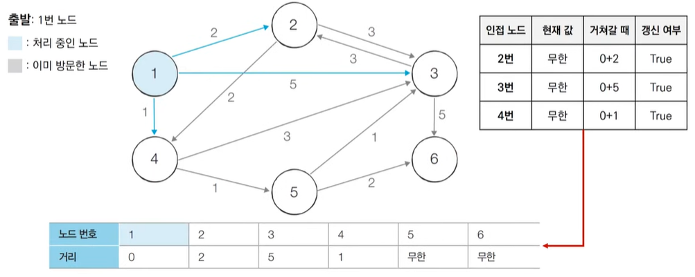
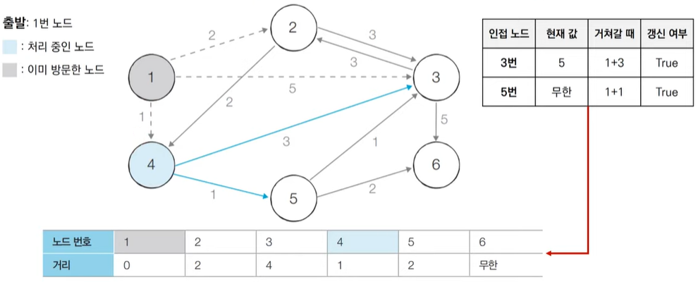
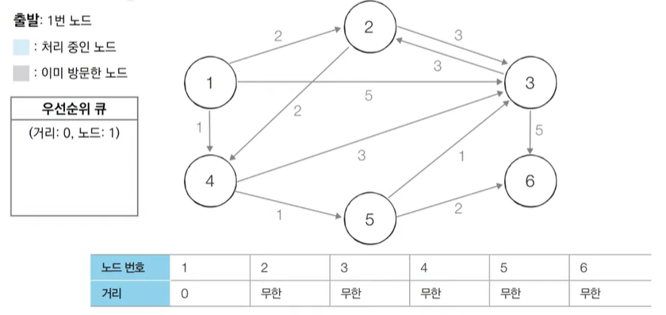
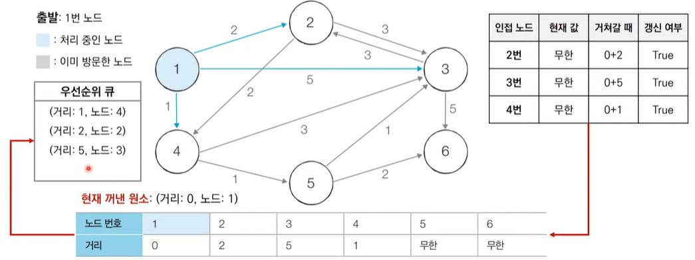
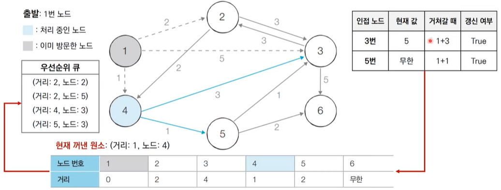

# 최단 경로 알고리즘(우선순위 큐)

> 가장 짧은 경로를 찾는 알고리즘
>
> 노드와 간선

### 다익스트라 최단 경로 알고리즘

> 특정한 노드에서 출발하여 다른 모든 노드로 가는 최단 경로 계산(그리디 알고리즘: 매 순간에 가장 비용이 적은 노드 선택함)
>
> 시간복잡도 O(V^2)

**동작 과정**

1. 출발 노드 설정

2. 최단 거리 테이블을 초기화(무한대)

3. 방문할 수 있는 모든 노드에 대해 조사하여 테이블 갱신

4. 방문하지 않은 노드 중 최단 거리가 가장 짧은 노드 선택

5. 해당 노드를 거쳐 다른 노드로 가는 비용을 계산하여 최단 거리 테이블 갱신

   => 그리디 알고리즘

6. 3번과 4번의 과정 반복







### 우선순위 큐

> 우선순위가 가장 높은 데이터를 가장 먼저 삭제
>
> 최소 힙(값이 낮은 데이터부터 꺼내기), 최대 힙(값이 큰 데이터부터 꺼내기) : log(N)

```python
import heapq

def heapqsort(arr):
    h = []
    result = []
    # 모든 원소를 차례대로 힙에 삽입
    for value in arr: 
        heapq.heappush(h, value)
    # 힙에 삽입된 모든 원소를 차례대로 꺼내서 담기
    for i in range(len(h)):
        result.append(heapq.heappop(h))
    return result

# 최소 힙으로 알아서 오름차순으로 정렬됨
result = heapqsort([1, 3, 5, 7, 9, 2, 4, 6, 8, 0])
print(result) // [0, 1, 2, 3, 4, 5, 6, 7, 8, 9]
```

```python
import heapq

def heapqsort(arr):
    h = []
    result = []
    # 모든 원소를 차례대로 힙에 삽입
    for value in arr: 
        heapq.heappush(h, -value)
    # 힙에 삽입된 모든 원소를 차례대로 꺼내서 담기
    for i in range(len(h)):
        result.append(-heapq.heappop(h))
    return result

# 최대 힙으로 내림차순 정렬됨
result = heapqsort([1, 3, 5, 7, 9, 2, 4, 6, 8, 0])
print(result) // [9, 8, 7, 6, 5, 4, 3, 2, 1, 0]
```


### 우선순위 큐를 사용한 다익스트라 알고리즘

> O(ElogV) : E개의 원소를 우선순위 큐에 넣었다가 빼는 연산과정과 비슷



초기 단계에서 초기 노드는 0으로 초기화하는 것은 일반 다익스트라 알고리즘과 같음.



우선순위 큐에 노드를 넣어 인접 노드의 거리를 계산해 갱신된 거리값을 큐에 넣어준다.



짧은 거리 기준으로 정렬되므로 우선순위 큐에서 값을 꺼내서 노드를 기준으로 인접 노드의 거리를 계산하여 반복적으로 계산해준다.


```python
import heapq

INF = int(1e9)
n, m = map(int, input().split())
start = int(input())
graph = [[] for i in range(n+1)]
# 최단 거리 테이블 무한으로 초기화
distance = [INF] * (n+1)

for _ in range(m):
    a, b, c = map(int, input().split())
    graph[a].append((b, c))
    

def dijkstra(start):
    q = []
    # 시작 노드로 가기위한 최단 거리는 0으로 설정하여 큐에 삽입
    heapq.heappush(q, (0, start))
    distance(start) = 0
    while q: 
        # 가장 최단 거리가 짧은 노드에 대한 정보 꺼내기
        dist, now = heapq.heappop(q)
        # 현재 노드가 이미 처리된 적이 있는 노드라면 무시
        if distance[now] < dist:
            continue
        # 현재 노드와 연결된 노드 확인
        for i in graph[now]:
            cost = dist + i[1]
            # 현재 노드를 거쳐서 다른 노드로 이동하는 거리가 더 짧은 경우
        	if cost < distance[i[0]]:
                distance[i[0]] = cost
                heapq.heappush(q, (cost, i[0]))
          
# 다익스트라 알고리즘 수행
dijkstra(start)

# 모든 노드로 가기위한 최단 거리 출력
for i in range(1, n+1):
    if distance[i] == INF:
        print('INFINITY')
    else:  # 도달 할 수 있는 경우 거리 출력
        print(distance[i])
```


문제 참고 : https://www.youtube.com/watch?v=5Lu34WIx2Us

